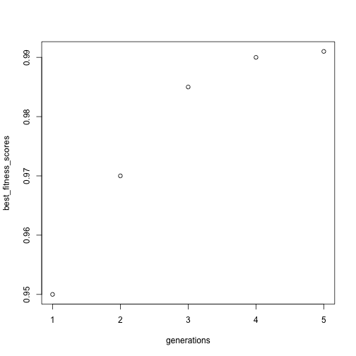

Genetic algorithm quit condition 16/07/14
========================================================

The genetic algorithm needs to stop when the fitness score of the best permutation in each generation, is no longer being improved, or is being improved by a negligible amount.
To achieve this I have added 2 quit conditions for the algorithm:

1. A specified number of generations is reached (this can be set to a number that is so high it is not expected the algorithm won't have already finished)

2. **The area under the curve of improvement does not increase by a certain percentage**

### Area under the curve

``n = number of generations``

``p = percentage of area under curve``

The fitness scores of best permutations from the last ``n`` generations are added to an array/vector. This vector plotted against x values that represent each generation, and the slope is calculated.


```r
best_fitness_scores <- c(0.95,0.97,0.985,0.99,0.991)
generations <- 1:length(best_fitness_scores)
plot(generations, best_fitness_scores)
```

 

```r
require(pracma)
```

```
## Loading required package: pracma
```

```
## Warning: package 'pracma' was built under R version 3.0.2
```

```r
trapz(generations, best_fitness_scores)
```

```
## [1] 3.916
```

If the area under the curve calculated by trapz for the last ``n`` generations is less than ``p``% larger than the area under the curve for the previous ``n`` generations, the improvement is judged to be negligible. The algorithm loop is ended.
