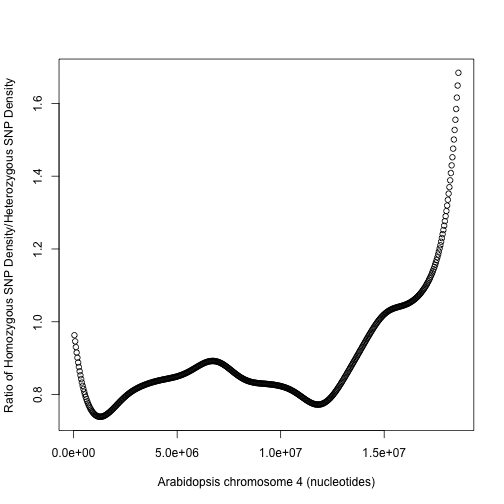
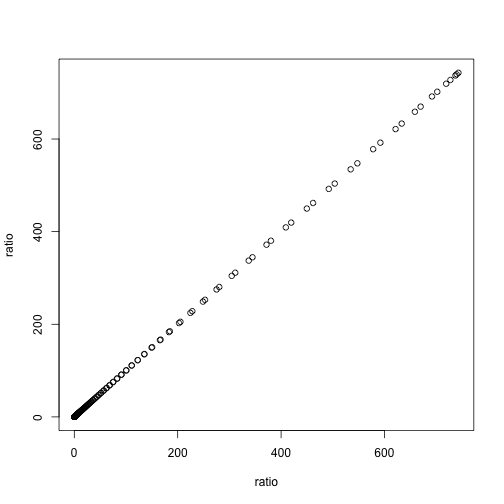
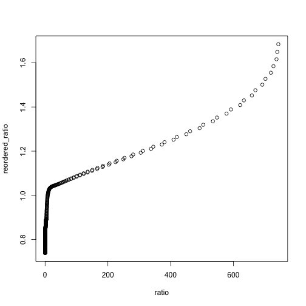
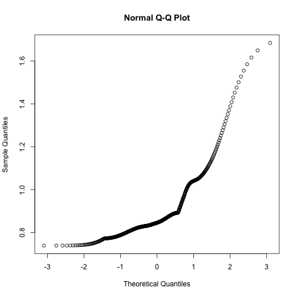
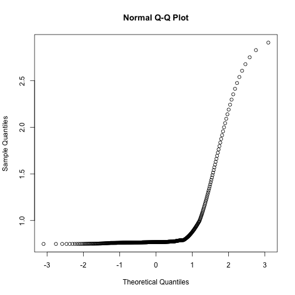

Genetic Algorithm idea: Progress as of 27/02/14
========================================================

Homozygous/Heterozygous SNP ratio across the model genome
-------

Example of the SNP distribution used in creation of the model genome:


```r
hm <- rnorm(35, 1e+07, 5e+06)  # Homozygous SNP positions
ht1a <- rnorm(1500, 5e+06, 1e+06)
ht1 <- ht1a[which(ht1a < 7500000)]  #non-recombinant region = 7.5m-12.5m
ht2a <- rnorm(1500, 1.5e+07, 1e+06)
ht2 <- ht2a[which(ht2a > 12500000)]  #non-recombinant region = 7.5m-12.5m
ht <- c(ht1, ht2)  # Heterozygous SNP positions
```


Working out the ratio of homozygous to heterozygous SNP density across the model genome:


```r
hmd <- density(hm, from = 0, to = 18585056)  # Arabidopsis thaliana chromosome 4 has 18585056 bp
htd <- density(ht, from = 0, to = 18585056)
x <- (1:512) * 36298.9375  # The number of equally spaced points at which the kernel density was estimated is 512. Multiplying each of the values from 1 to 512 by 36298.9375, gives appropriate x axis values for the 18585056 bp model genome.
ratio <- hmd$y/htd$y
plot(x, ratio, xlab = "Arabidopsis chromosome 4 (nucleotides)", ylab = "Ratio of Homozygous SNP Density/Heterozygous SNP Density")
```

 


Example of SNPs as they are distributed across the model genome, when contigs are incorrectly (randomly) ordered:


```r
reordered_ht <- as.vector(as.matrix(read.table("~/fragmented_genome_with_snps/arabidopsis_datasets/ratio_dataset3/het_snps.txt", 
    quote = "\"")))
reordered_hm <- as.vector(as.matrix(read.table("~/fragmented_genome_with_snps/arabidopsis_datasets/ratio_dataset3/hom_snps.txt", 
    quote = "\"")))
```


Working out the ratio of homozygous to heterozygous SNP density across the model genome, when contigs are incorrectly (randomly) ordered:


```r
reordered_hmd <- density(reordered_hm, from = 0, to = 18585056)
reordered_htd <- density(reordered_ht, from = 0, to = 18585056)
reordered_ratio <- reordered_hmd$y/reordered_htd$y
plot(x, reordered_ratio, xlab = "Arabidopsis chromosome 4 (nucleotides)", ylab = "Ratio of Homozygous SNP Density/Heterozygous SNP Density")
```

 


Q-Q plots and pearson correlation values derived from them (score of fitness)
---------

### Comparing against an example ratio

Q-Q plot showing matching distributions (example distribution from above plotted against itself):


```r
qqp <- qqplot(ratio, ratio)
```

 

```r
cor(qqp$x, qqp$y)
```

```
## [1] 1
```


Q-Q plot of the distribution across the model genome when contigs are incorrectly (randomly) ordered, with the example distribution (which is the correct distribution):


```r
qqp <- qqplot(ratio, reordered_ratio)
```

 

```r
cor(qqp$x, qqp$y)
```

```
## [1] 0.8719
```


### Comparing with normal expected quantiles

Q-Q plot of the example distribution with normal expected quantiles:


```r
qqp <- qqnorm(ratio)
```

 

```r
cor(qqp$x, qqp$y)
```

```
## [1] 0.5947
```


Q-Q plot of the distribution across the model genome when contigs are incorrectly (randomly) ordered, with normal expected quantiles:


```r
qqp <- qqnorm(reordered_ratio)
```

 

```r
cor(qqp$x, qqp$y)
```

```
## [1] 0.8768
```


Performance of Genetic Algorithm [GATOC](https://github.com/edwardchalstrey1/fragmented_genome_with_snps/blob/master/lib/GATOC.rb) (Genetic Algorithm To Order Contigs) so far
--------

The genetic algorithm has been succesful in finding permutations with higher fitness scores in each generation. This suggests that the reproduction methods of GATOC are effective. The fitness score does however, quickly reach a point where the improvements are very small.


The Circos plot below shows the performance for 100 generations with otherwise default parameters. The ordering of the contigs does not appear to have significantly improved.


The ordinal similarity scores also show that the best permutations from the genetic algorithm are little better than an average randomly ordered permutation:


The algorithm is not reordering the contigs so that the peak(s) in the distribution are in the correct area(s) of the genome. Instead, permutations with large peaks at the edges of the genome are giving high fitness scores.
**Best permutation from generation 100:**


Ordinal similarity score ([rearrangement score](https://github.com/edwardchalstrey1/fragmented_genome_with_snps/blob/master/lib/rearrangement_score.rb)) of permuation compared with correctly ordered contigs: 523180/767560   (767560 being the worst possible score)
[GATOC](https://github.com/edwardchalstrey1/fragmented_genome_with_snps/blob/master/lib/GATOC.rb) fitness score = 0.997493070748546

In another run of the algorithm, the best permutation had a peak on the opposite end of the genome:


Judging from the poor ordinal similarity score, the circos plot, and the shape of the distribution for a permutation with a high fitness score, my conclusion is that the current fitness method does not give a good representation of the "correctness" of a given permutation of contigs.

### What does the evolution of the best permutations of contig order look like?

**Generation 1**


**Generation 25**


**Generation 50**


**Generation 100**


It is clear that the algorithm very quickly identifies the peak at one end of the genome as having a high fitness score. Subsequent improvements appear to flatten out the rest of the distribution. This would be useful if the peak were in the correct part of the genome. 

The next step
------

I will modify the fitness method used by the genetic algorithm, so that the peaks in the correct part of the genome get a higher score than other peaks.

### What does qqnorm look like for the best permutations from the genetic algorithm (where the peak is at the end of the genome)


```r
gen100_ht <- as.vector(as.matrix(read.table("~/fragmented_genome_with_snps/arabidopsis_datasets/ratio_dataset4/run4/gen100_best_permutation_het_snps.txt", 
    quote = "\"")))
gen100_hm <- as.vector(as.matrix(read.table("~/fragmented_genome_with_snps/arabidopsis_datasets/ratio_dataset4/run4/gen100_best_permutation_hom_snps.txt", 
    quote = "\"")))

gen100_hmd <- density(gen100_hm, from = 0, to = 18585056)
gen100_htd <- density(gen100_ht, from = 0, to = 18585056)
gen100_ratio <- gen100_hmd$y/gen100_htd$y
```


Q-Q plot of the distribution across the model genome for the best contig permutation (fitness) from generation 100, with normal expected quantiles:


```r
qqp <- qqnorm(gen100_ratio)
```

 

```r
cor(qqp$x, qqp$y)
```

```
## [1] 0.6367
```


The shape of the graph and correlation value appears to be similar to that of the correct distribution (see sample distribution qqnorm plot above), which means that qqnorm won't be useful in distinguishing permutations with peaks in the correct position.
