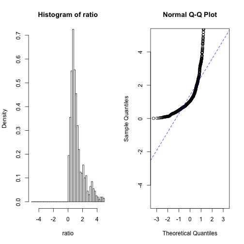
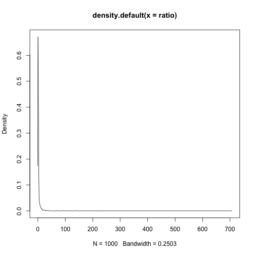
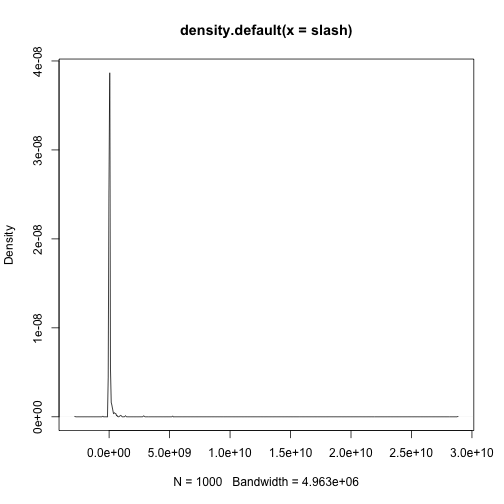
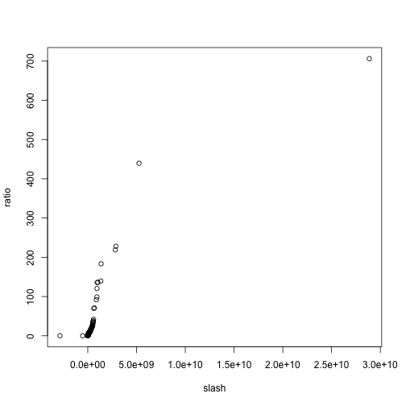
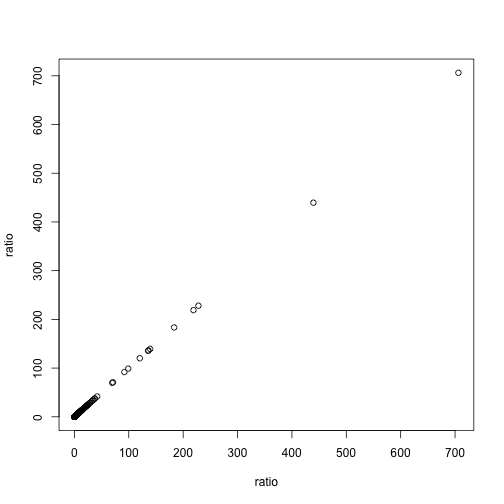

Progress 18/3/14
========================================================

It turns out that the ratio of a normal distribution to a uniform distribution is a *slash* distribution:


```r
# Homozygous SNP list (normal)
hm <- rnorm(10000, 1e+07, 5e+06)
remove <- c()
x <- 1
for (i in hm) {
    if (i < 0 || i > 18585056) {
        remove <- c(remove, x)
    }
    x <- x + 1
}
hm <- hm[-c(remove)]

# Heterozygous SNP list (uniform)
ht <- runif(10000, 1, 18585056)

# Ratio of samples
ratio <- sample(hm, 1000)/sample(ht, 1000)  # numer. and denom. must be same length
```


I have decided that a good way to work out the ratio is by taking samples of the SNP distributions, then calculating the ratio of the sample vectors. With the SNP lists I was using in [New_Model_Genome](https://github.com/edwardchalstrey1/fragmented_genome_with_snps/blob/normal/Progress/New_Model_Genome.md), this would not have been useful, as the number of homozygous SNPs in the model was so low.
From consulting literature that describes the kind of back-cross experiment I am modelling, including [Uchida et al (2011)](http://pcp.oxfordjournals.org/content/52/4/716.long), I have concluded that the actual numbers of SNPs can vary largely, based on the specific experiment. For subsequent versions of my model genome, I will use 10,000 of each kind of SNP. I can try and use experimental SNP data once I have got the genetic algorithm to re-order contigs from the model.


```r
par(mfrow = c(1, 2))  # puts 2 plots side by side

# Histogram of ratio
hist(ratio, xlim = c(-5, 5), breaks = c(-Inf, seq(-5, 5, 0.2), Inf), freq = F, 
    ylim = c(0, 0.7))

# Normal Q-Q plot
qqnorm(ratio, ylim = c(-5, 5))
qqline(ratio, xlim = c(-5, 5), lty = 2, col = "blue")
```

 


As the above figures show, the ratio does not follow a normal distribution. Instead, as illustrated by the example below, we will have a slash distribution.


```r
set.seed(123)
X <- rnorm(10000)
Y <- runif(10000)
Z <- X/Y
dslash <- function(x) (dnorm(0) - dnorm(x))/x^2

x <- seq(-5, 5, 0.02)
hist(Z, xlim = c(-5, 5), breaks = c(-Inf, seq(-5, 5, 0.2), Inf), freq = F, ylim = c(0, 
    0.4))
lines(x, dslash(x), xlim = c(-5, 5), col = "red")
lines(x, dnorm(x), xlim = c(-5, 5), col = "blue", lty = 2)
```

 

```r

qqnorm(Z, ylim = c(-5, 5))
qqline(Z, xlim = c(-5, 5), lty = 2, col = "blue")
```

 


If the ratio follows the slash distribution, then we should be able to use Q-Q plot to compare it with an example slash.


```r
plot(density(ratio))
```

 

```r
library("VGAM", lib.loc = "/Library/Frameworks/R.framework/Versions/3.0/Resources/library")
```

```
## Warning: package 'VGAM' was built under R version 3.0.2
```

```
## Loading required package: splines
## Loading required package: stats4
## 
## Attaching package: 'VGAM'
## 
## The following object is masked _by_ '.GlobalEnv':
## 
##     dslash
## 
## The following object is masked from 'package:stats4':
## 
##     coef
## 
## The following object is masked from 'package:splines':
## 
##     bs, ns
## 
## The following objects are masked from 'package:stats':
## 
##     case.names, coef, coefficients, df.residual, dfbeta, fitted,
##     fitted.values, formula, hatvalues, poly, residuals,
##     variable.names, weights
## 
## The following object is masked from 'package:base':
## 
##     identity, scale.default
```

```r
slash <- rslash(1000, mu = 1e+07, sigma = 5e+06)
plot(density(slash))
```

 

```r
qqp <- qqplot(slash, ratio)
```

 

```r
qqplot(ratio, ratio)
```

 


So far, I have not found a way to use a slash ratio to compare against in the Q-Q plot, so for now I will use the example ratio itself, which is based on the SNP distributions put into the model genome.
